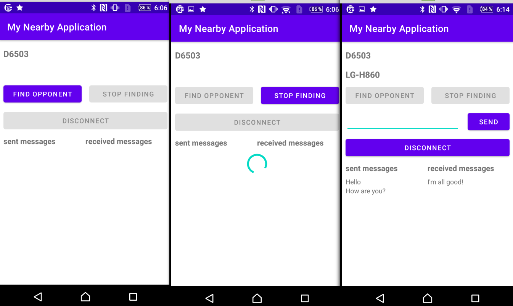

# Network Communications Using Nearby

Nearby Connections is a peer-to-peer networking API that allows apps to easily discover, connect to, and exchange data with nearby devices in real-time, regardless of network connectivity. It uses Bluetooth, Wi-Fi, and other technologies, and is designed to hide the complexity of these technologies so your app can focus on discovering and interacting with nearby devices easily.

Some example use cases:
* Collaborative whiteboard: 
* Jot ideas down with nearby participants on a shared virtual whiteboard.
* Local multiplayer gaming: Set up a multiplayer game and invite other users nearby to join.
* Multi-screen gaming: Use a phone or tablet as a game controller to play games displayed on a nearby large-screen Android device, such as Android TV.
* Offline file transfers: Share photos, videos, or any other type of data quickly and without requiring a network connection.

The program shows an example of implementing integration with Nearby Connections.

